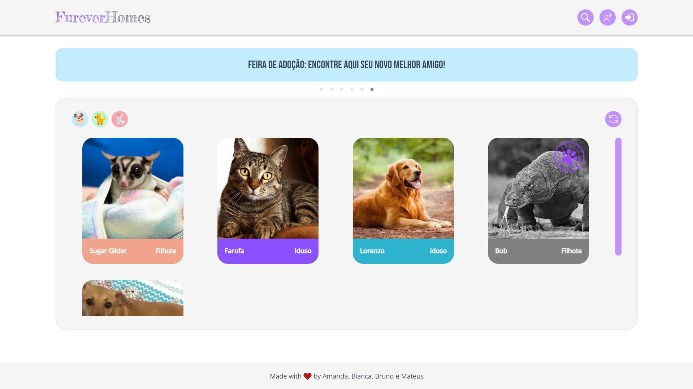

# FUREVER HOMES

A Furever Homes é um espaço onde pessoas que resgatam animais de rua conseguem ajudar esses animais à encontrar um novo lar, ao mesmo tempo que pessoas procurando por um novo bichinho podem vir e encontrar seu novo pet, tudo em um único lugar.

## 🔨 Funcionalidades do projeto

A Furever Homes possui quatro páginas. Sua página principal é a home, onde a lista de pets e a maiorias das funcionalidades se encontram.

### Login

Na página de login temos o formulário de login e botões para levar o usuário para tanto a página home e a página de registro de usuário. O usuário é automaticamente levado à página home depois do login ser efetuado.

### Registro

A página de registro de usuário contém o formulário para registrar um novo usuário, além de botões para a página de login e a página home. O usuário é automaticamente levado à página de login depois do registro ser feito.

### 404

Temos também uma tela de erro caso o usuário entre na URL errada. Nessa página temos um botão que leva o usuário para a página home.

### Home

E por último, temos a página home como página principal. Na página home temos a lista de pets para adoção, filtros de pesquisa por nome do pet e filtros pelo tipo do pet, entre "cachorro", "gato" e "outros". Também temos uma funcionalidade de alterar os botões no header conforme o usuário esteja logado ou não (isso também se aplica as funcionalidades de adotar um pet ou colocar um pet para adoção).
Se o usuário não estiver logado ele vai ver os botões de pesquisa, cadastrar usuário e logar. Se o usuário estiver logado ele vai ver os botões de pesquisa, cadastrar um pet e deslogar.
Os cards dos pets para adoção são clicáveis, abrindo um card maior com mais informações sobre o pet selecionado. Dentro desse card também temos um botão para fazer a adoção. Se o usuário estiver logado ele pode adotar o pet, se não, um modal de login vai abrir. O pet sendo adotado faz com que seu card mude de cor e não abra mais, também é colocado um carimbo de adotado.
Temos um botão para por um pet para adoção. Ao clicar nele um modal abre e você consegue cadastrar um pet para entrar na lista de adoção.

## ✔️ Tecnologias e Ferramentas utilizadas

- `HTML`: O HTML tem um papel fundamental para a aplicação funcionar corretamente.
- `CSS`: O CSS tem papel fundamental para indicar a interação do usuário com a interface gráfica.
- `TypeScript`: O TypeScript proporcionará todas as funcionalidades da aplicação.
- `React`: O React faz com que a aplicação seja uma SPA (single page application).
- `Figma`: Aqui se encontra o <a href="https://www.figma.com/file/YrTlwnMXGU2EBLGm17CJwJ/Furever-Homes?type=design&node-id=0%3A1&t=pPlBJZOOa8HP7hNE-1" target="_blank">figma</a> do projeto, onde foi decidida a estrutura e estilização.

## ✔️ Bibliotecas utilizadas

- fireworks react `version 2.10.3`
- react hook form `version 7.43.9`
- react alice carousel `version 2.7.1`
- react icons `version 4.8.0`
- react router dom `version 6.10.0`
- react toastify `version 9.1.2`
- react tooltip `version 5.11.2`
- styled components `version 5.3.10`
- zod `version 3.21.4`
- axios `version 1.3.6`
- vite `version 4.3.2`

## ⌛ Status do projeto

Finalizado.

## 📁 Acesso ao projeto

[Veja o site Furever Homes em funcionamento](https://furever-homes.vercel.app).

Neste repositório você tem acesso a todos os arquivos e códigos da aplicação. 
Já neste <a href="https://github.com/projeto-final-m3-adoption/furever-homes-backend" target="_blank">repositório</a> você tem acesso a todos os arquivos da fake API utilizada.

## 🛠️ Abrir e rodar o projeto

Para abrir o projeto, basta clonar o repositório e digitar o comando `npm install` no terminal, para instalar os pacotes do projeto. 
Para rodar o projeto, bastar digitar o comando `npm run dev` no terminal, e navegar para o local host especificado.

## 👩‍💻 Pessoas desenvolvedoras do projeto

<a href="https://github.com/amandadolci" target="_blank">Amanda Dolci Figueiredo</a> | <a href="https://github.com/bitoller" target="_blank">Bianca Toller</a> | <a href="https://github.com/BrunoAPdaC" target="_blank">Bruno Cruz</a> | <a href="https://github.com/mateusjfeldhaus" target="_blank">Mateus Feldhaus</a>
